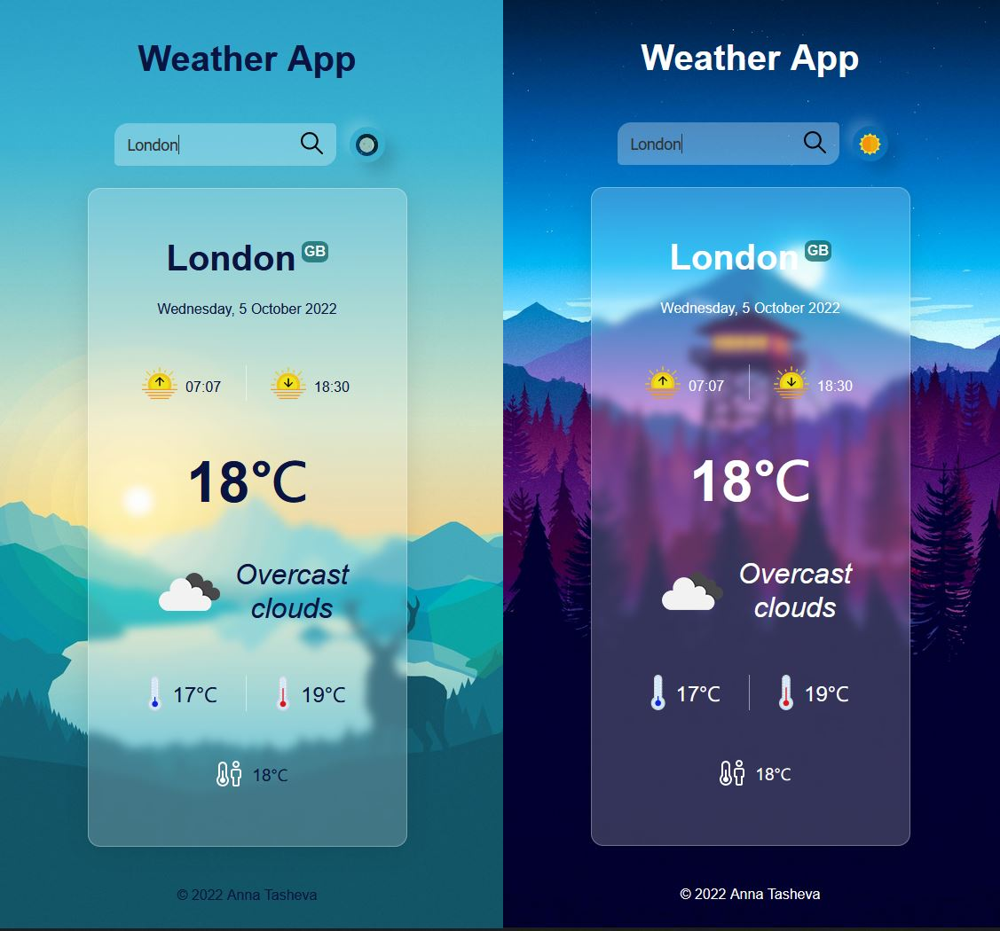

# About

A simple weather app website created with JavaScript, CSS and HTML. The app fetches data from the OpenWeatherMap API in order to create a website that displays the current weather for any location. 

# Screenshots

# See live 
https://annatas-weather-app.netlify.app/

# Features

+ Autocomplete feature with matching letters in bold

+ Toggle between dark and light mode via a toggle button

+ Uses `prefers-color-scheme` to detect and dynamically adjust the dark and light mode based on the system preferences of the user.

+ A custom pop-up modal box to notify the user if the city name does not exist or if the search field has been left empty.

+ Responsive web design approach used to create content that adjusts smoothly to various screen sizes.

# Technologies

+ JavaScript
+ HTML
+ CSS

